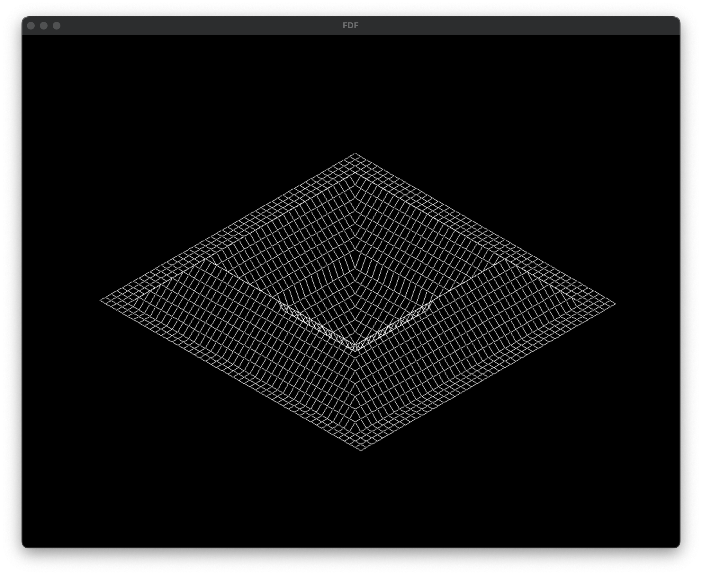
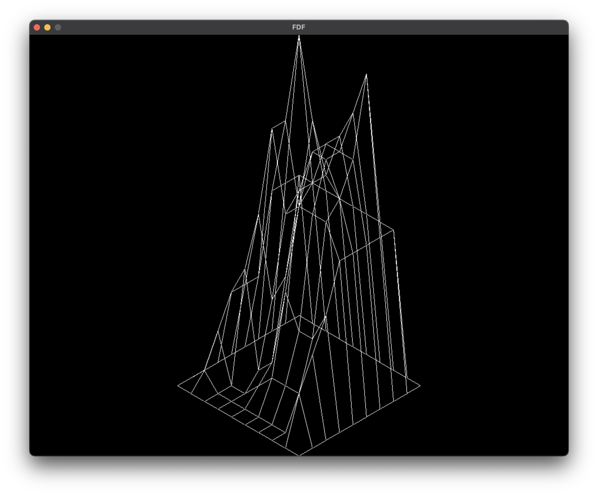
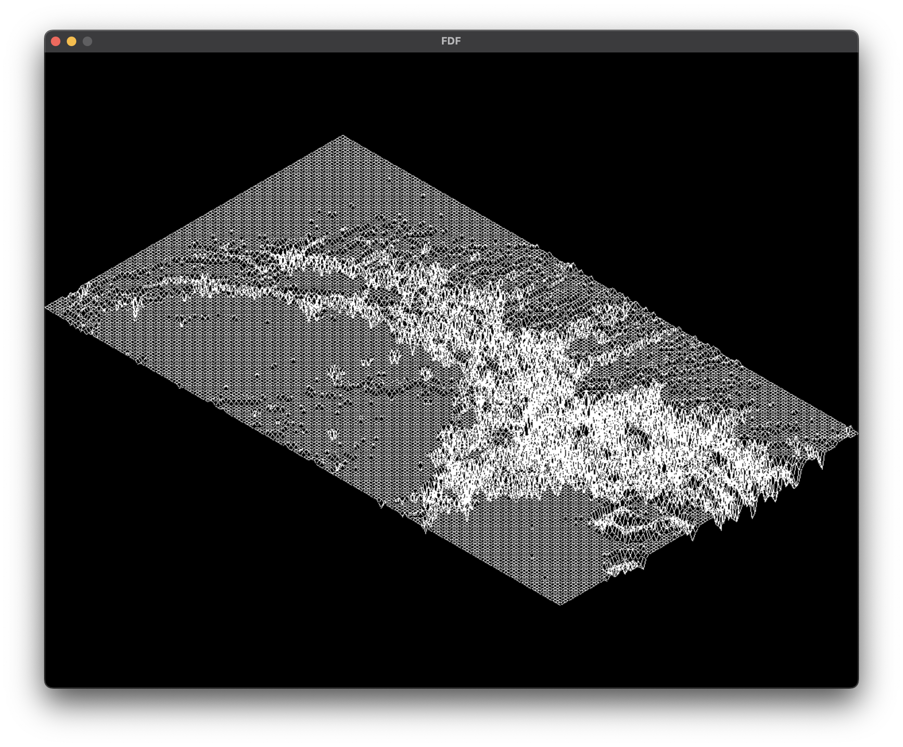

# Wire Frame
### [notion](https://u-lo-l.notion.site/FDF-c1fedfd2accf406bb82511fa5d213e68)
### implemtation
- Translation
- Rotation (x-axis, y-axis, z-axis, any-axis)
- isometric projection
- color distribution by height
### Sample image
</img>
</img>
</img>
</img>
</img>
