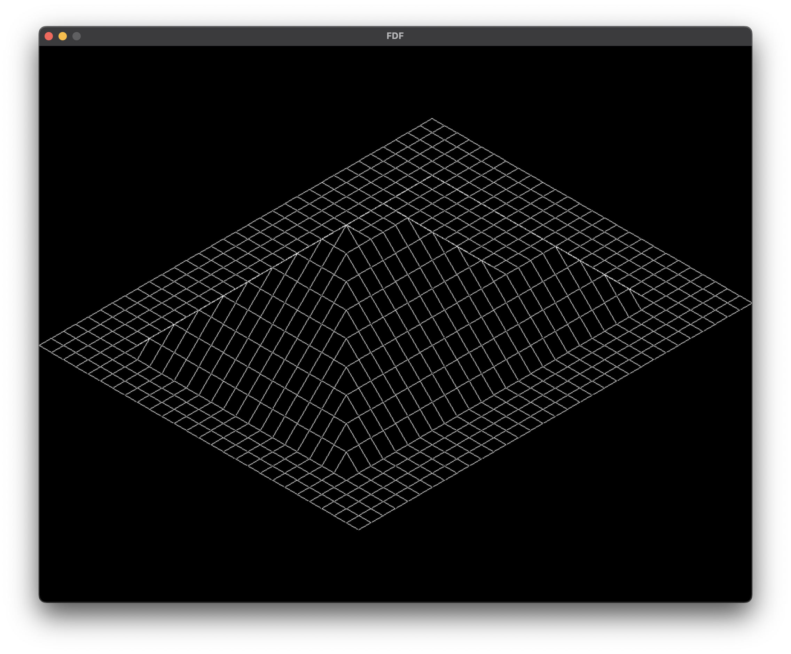

# Wire Frame

### implemtation
- Translation
- Rotation (x-axis, y-axis, z-axis, any-axis)
- isometric projection
- color distribution by height
### Sample image
</img>
</img>
</img>
</img>
</img>

